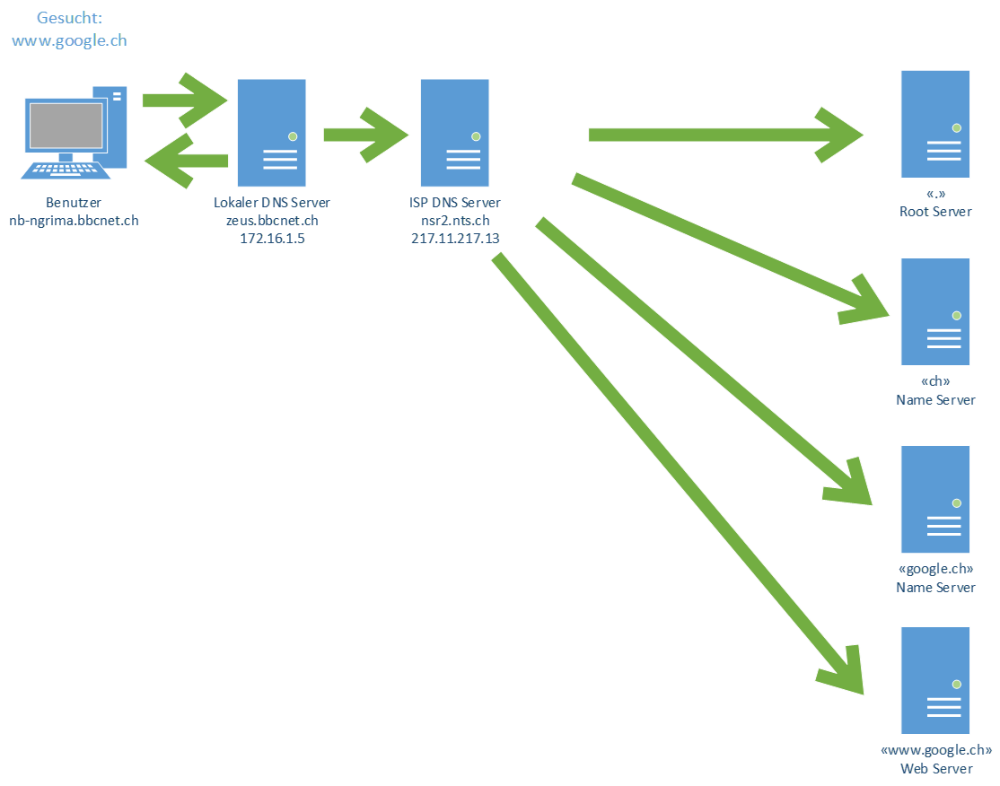

# Protokolle der Anwendungsschicht
| Protokoll | Port           | Beschreibung                                                              |
| --------- | -------------- | ------------------------------------------------------------------------- |
| HHTP      | 80, tcp        | Hyper Text Transfer Protocol, WWW                                         |
| HTTPS     | 443, tcp       | HTTP über TLS/SSL                                                         |
| FTP       | 21, tcp, udp   | File Transfer Protocol                                                    |
| POP3      | 110, tcp       | Post Office Protocol, E-Mails-Abruf                                       |
| SMTP      | 25, tcp, udp   | Simple Mail Transfer Protocol, E-Mail-Versand                             |
| DNS       | 53, tcp, ddp   | Domain Name System                                                        |
| SSH       | 22, tcp        | Secure Shell (_verschlüsseltes remote Terminal_)                          |
| Telnet    | 23, tcp        | Telnet (_unverschlüsseltes remote Terminal_)                              |
| SNMP      | 161, tcp, udp  | Simple Network Management Protocol (_Verwaltung con Geräten im Netzwerk_) |
| SIP       | 5060, tcp, udp | Session Initiation Protocol                                               |
| RTSP      | 554, tcp, udp  | Real Time Streaming Protocol                                              |
| NTP       | 123, tcp, udp  | Network Time Protocol (_Zeit Synchronisation_)                                                                          |

# Applikations Protokolle
## DNS
- DNS steht für **D**omain **N**ame **S**ystem
- Der DNS-Dienst läuft auf dem Application Layer 7. Jedoch werden die Packete auf Layer 4 versendet. 
- Es ist ein Service, welcher IP-Adressen in Namen auflöst und auch umgekehrt. 

## LDAP
- LDAP steht für **L**igthweight **D**irectory **A**cces
- Verzeichniszugriffsprotokoll
- TCP/UDP Port 389
- Microsoft Active Directory verwendet LDAP
