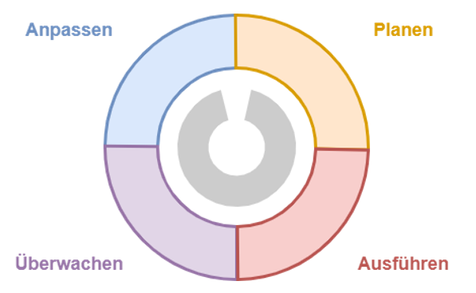
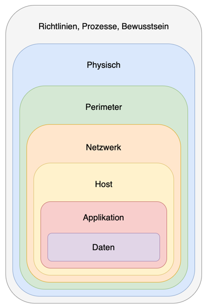
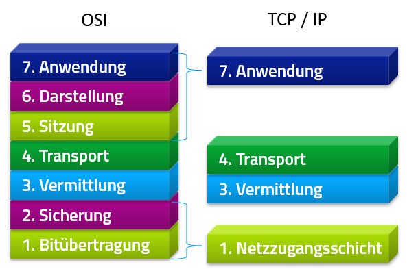
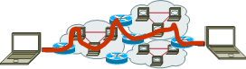
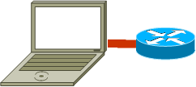
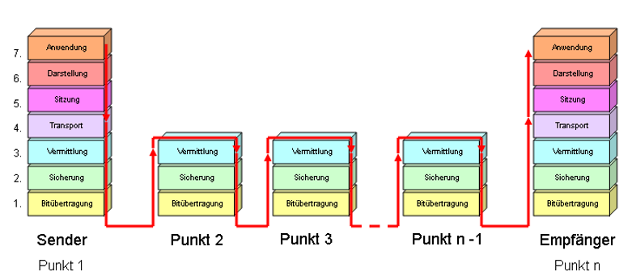

# Grundlagen World Cafe
## IT Sicherheit
Sind Massnahmen zur Planung, Ausführung und Überwachung der Sicherheit in Netzen.

### Teilbereiche der IT Sicherheit
- Konsistenz von Daten und Diensten
- Software-Updates
- Authentifizierung
- Autorisierung
- Überwachung von Rechnern
- Freigabe/Vergabe von Ressourcen
- Sicherung von Ressourcen
- Transport von Daten
- Firewall / DMZ
- Zugangskontrolle
### Defense in Depth Prinzip
Das Defense in Depth Prinzip ist eine Idee/Konzept welches uns Hilft IT-Sicherheit zu umsetzen. Man Arbeitet sich von Aussen nach Innen. Jeder Layer baut auf dem darüber liegendem Layer auf.
- Richtlinien, Prozesse,  Bewusstsein
- Physikalische Sicherheit
- Perimeter (Anbindung)
- Netzwerk
- Host
- Applikation
- Daten

### Schutzziele
- Schutzziele sind Aussagen bzw. Definitionen über ein Sicherheitsniveau, das im Minimum erreicht werden soll
- Sprich für jeden Layer, sollte man entsprechend Schutzziele definieren
## Richtlinien, Bewusstsein, Prozesse
- Frameworks:
	- ISO27001
	- ITIL
- Benutzerschulung
- Regelmässige Informationen
- Benutzerbedürfnisse kennen
- Gefahren kennen
- Prozesse definieren
## Physikalische Sicherheit - Gebäude
**Wenn jemand physischen Zugang zu deinem Computer hat, so ist es nicht mehr dein Computer sondern seiner**
- Er kann ihn einfach neu installieren
- Er kann von einem USB Stick booten
- Er kann eigentlich alles damit machen was er will.
**Wie verhindern wir das?**
- Zutrittskontrolle
- Empfang
- Umzäunung
- Sichtschutz
- Spezielle Räume
	- Serverraum
	- Labors
	- Testumgebungen
	- Büros

# Networkrefresh
##  Referenzmodelle
- TCP / IP
   - IP Protokollfamilie umfasst ca. 500 Netzwerkprotokolle
   - Beschreibt die Kommunikationsaufgaben auf unterschiedlichen Schichten

- ISO / OSI (Ist eher abstrakter als das TCP/IP Modell, es ist wichtig beide zu kennen, meist ist es für Netzwerker ausreichend das TCP/IP gut zu kennen)
   - Design-Grundlage für Kommunikationsprotokolle
### TCP/IP Referenz Modell

## OSI
### OSI-Modell - Verbindung
 | OSI-Schichten | Aufgabe der Schicht                                                                                                         | Übertragen werden... | Verbindung                                           |
 | ------------- | --------------------------------------------------------------------------------------------------------------------------- | --------------------- | ---------------------------------------------------- |
 | 7             | **Anwendungsschicht** Funktionsaufruf durch die Anwender                                                                    | Data                  | Ende zu Ende  | 
 | 6             | **Darstellungsschicht** Umwandlung der Daten in eigenes Format                                                              | Data                  | Ende zu Ende                                         |
 | 5             | **Sitzungs- / Kommunikationsschicht** Verbindung zwischen den Endsystemen                                                   | Data                  | Ende zu Ende                                         |
 | 4             | **Transportschicht** Datenpacket wird einer Anwendung der Endgeräte                                                         | Segments              | Ende zu Ende                                         |
 | 3             | **Netzwerk- / Vermittlungsschicht** Erstmalige logische Adressierung der Endgeräte                                          | Packets               | Punkt zu Punkt                                       |
 | 2             | **Sicherungsschicht** Physikalische Adressierung mit Fehlererkennung, Fehlerbehebung und Datenflusskontrolle                | Frames                | Punkt zu Punkt                                       |
 | 1             | **Bitübertragungsschicht** Definition der elektrischen, mechanischen und funktionalen Schnittstellen zum Übertragungsmedium | Bits                  | Punkt zu Punkt                                       |
### OSI-Modell - Netzkomponenten
| OSI-Schichten | Aufgabe der Schicht     | Übertragen werden... | Netzkomponenten                               |
| ------------- | ----------------------- | -------------------- | --------------------------------------------- |
| 7             | Anwendung               | Data                 | Web Application Firewall, Web-Proxy, Firewall |
| 6             | Datendarstellung        | Data                 | Web Application Firewall, Web-Proxy, Firewal  |
| 5             | Kommunikationssteuerung | Data                 | Web Application Firewall, Web-Proxy, Firewal  |
| 4             | Transport               | Segments             | Web Application Firewall, Web-Proxy, Firewal  |
| 3             | Vermittlung             | Packets              | Router                                        |
| 2             | Sicherung               | Frames               | Switch                                        |
| 1             | Bitübertragung          | Bits                 | Bridge, Hub, Repeater                         | 
### OSI-Modell - Protokolle
| OSI-Schichten | Aufgabe der Schicht     | Übertragen werden... | Protokolle                                       |
| ------------- | ----------------------- | -------------------- | ------------------------------------------------ |
| 7             | Anwendung               | Data                 | DNS, DHCP, HTTP, SSH, FTP, SNMP, SMTP, POP, IMAP |
| 6             | Datendarstellung        | Data                 | DNS, DHCP, HTTP, SSH, FTP, SNMP, SMTP, POP, IMAP |
| 5             | Kommunikationssteuerung | Data                 | DNS, DHCP, HTTP, SSH, FTP, SNMP, SMTP, POP, IMAP |
| 4             | Transport               | Segments             | TCP, UDP                                         |
| 3             | Vermittlung             | Packets              | IP, ICMP                                         |
| 2             | Sicherung               | Frames               | Ethernet, ARP, IEEE 802                          |
| 1             | Bitübertragung          | Bits                 | PPP, Frame Relay, ISDN                                                 |
### OSI-Modell - Analyse Tools
| OSI-Schichten | Aufgabe der Schicht     | Übertragen werden... | Analyse Tools                            |
| ------------- | ----------------------- | -------------------- | ---------------------------------------- |
| 7             | Anwendung               | Data                 | nslookup, ftp, net use                   |
| 6             | Datendarstellung        | Data                 | nslookup, ftp, net use                   |
| 5             | Kommunikationssteuerung | Data                 | nslookup, ftp, net use                   |
| 4             | Transport               | Segments             | netstat, telnet, nmap                    |
| 3             | Vermittlung             | Packets              | ipconfig, ping, route, tracert, pathping |
| 2             | Sicherung               | Frames               | arp                                      |
| 1             | Bitübertragung          | Bits                 | Hardware/Kabel                           | 
### Übermittlung von Daten

## TCP/IP
### TCP/IP-Modell - Verbindung
| OSI-Schichten | Aufgabe der Schicht | Übertragen werden... | Verbindung                                                 |
| ------------- | ------------------- | -------------------- | ---------------------------------------------------------- |
| 4             | Anwendung           | Data                 | Ende zu Ende        |
| 3             | Transport           | Segments             | Ende zu Ende        |
| 2             | Vermittlung         | Packets              | Punkt zu Punkt  |
| 1             | Netzzugang          | Frames, Bits         | Punkt zu Punkt  | 
### TCP/IP-Modell - Netzkomponenten
| OSI-Schichten | Aufgabe der Schicht | Übertragen werden... | Netzkomponenten                                      |
| ------------- | ------------------- | -------------------- | ---------------------------------------------------- |
| 4             | Anwendung           | Data                 | Ende zu Ende  |
| 3             | Transport           | Segments             | Ende zu Ende  |
| 2             | Vermittlung         | Packets              | Punkt zu Punk                                                     |

### TCP/IP-Modell - Protokolle
| OSI-Schichten | Aufgabe der Schicht | Übertragen werden... | Protokolle                                       |
| ------------- | ------------------- | -------------------- | ------------------------------------------------ |
| 4             | Anwendung           | Data                 | DNS, DHCP, HTTP, SSH, FTP, SNMP, SMTP, POP, IMAP |
| 3             | Transport           | Segments             | DNS, DHCP, HTTP, SSH, FTP, SNMP, SMTP, POP, IMAP |
| 2             | Vermittlung         | Packets              | TCP, UDP                                         |
| 1             | Netzzugang          | Frames, Bits         | Ethernet, ARP, IEEE 802, PPP, Frame Relay, ISDN  | 
