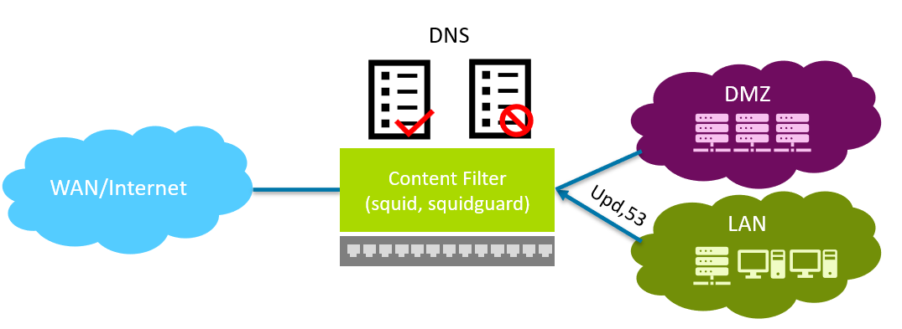
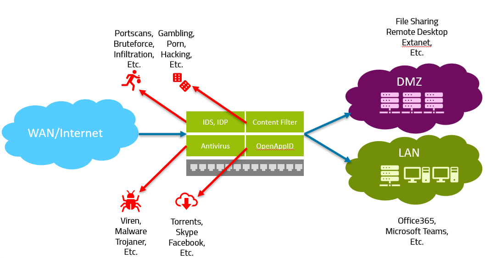
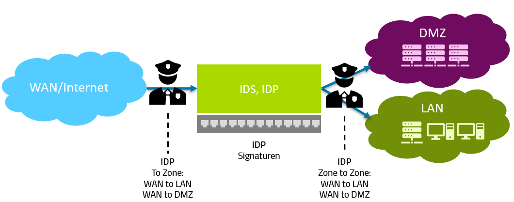

# Contentfilter

- Squidguard basiert auf squid (Proxy)
- Squidguard ist ein URL-Umleiter
- Basiert auf Listen und Schlüsselwörtern

# IDS und NIDS

Man nennt dies **UTM --> Unified Threat Management**. Teile davon gehen unter die Begriffe IDS und NIDS. 
**IDS** steht für **Intrusion Detection System**. Das **IDS** erkennt mit verschiedenen Detektionsmethoden verschiedene Attacken: Würmer, Trojaner, Back-Doors, Network- und Port Scans, Buffer-Overflows usw.

**Im Gegensatz zu einer Firewall wird auch der Dateninhalt untersucht.** Das IDP läuft auf der Firewall, sprich Traffic welchen nicht über sie läuft wird auch nicht vom **IDP** gescannt. Das **IDP** erkennt nur Dinge anhand der Signaturen (sprich neuartige Attacken welche nicht in den Signaturen sind bleiben unerkannt). **Unterschied IDP und NIDS**: IDP soll auch gleich blocken/vorbeugen, NIDS in erster Linie nur erkennen. 
